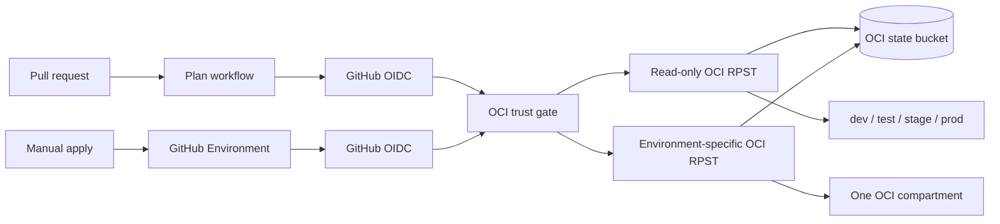

# Terraform on OCI with GitHub OIDC

This reference implements the GitHub-native golden path for Terraform on OCI across `dev`, `test`, `stage`, and `prod`.

- Non-secret environment configuration is versioned in [`workload/environments/`](workload/environments/).
- Pull request plans do not use GitHub Environments, so they do not create deployments or wait for deployment approval.
- Applies use the matching GitHub Environment and inherit its protection rules.
- GitHub OIDC tokens are exchanged for short-lived OCI Resource Principal Session Tokens (RPSTs).
- A read-only plan identity is separate from four environment-specific apply identities.
- OCI validates immutable GitHub owner and repository IDs before issuing an RPST.
- Terraform state is isolated by environment in a versioned OCI Object Storage bucket.
- The sample creates only free VCN resources. It does not create compute, databases, gateways, or load balancers.

## Authentication and authorization

OCI workload identity federation removes OCI users and long-lived OCI API keys from the pipeline, but it is not completely secretless on a GitHub-hosted runner.

OCI's token exchange endpoint must authenticate the caller with one of:

1. An OCI Identity Domain OAuth confidential client.
2. An OCI service principal signed request.
3. An OCI instance principal signed request.

A GitHub-hosted runner is not an OCI service or instance principal, so this implementation stores one OAuth client credential. The credential can only invoke token exchange and is insufficient without a valid GitHub-signed JWT. The GitHub JWT, OCI RPST, and request-signing key are generated per job and expire automatically.

The repository-owned action in [`.github/actions/oci-rpst/`](.github/actions/oci-rpst/) requests a JWT from GitHub's built-in OIDC endpoint, generates an ephemeral RSA key pair, and posts the JWT and public key to the documented OCI Identity Domain `/oauth2/v1/token` endpoint. It uses only `curl`, `jq`, and `openssl`, never disables TLS verification, masks the JWT and RPST, writes key, token, and OCI config files with mode `0600`, and sets `OCI_CLI_AUTH=security_token`.

OCI enforces two separate gates:

1. **Identity Propagation Trust authentication:** The trust accepts only GitHub's issuer, this repository's exact `repository_owner_id` and `repository_id`, the expected repository name, and one of the custom plan or environment audiences. A wrong repository or audience cannot receive an RPST.
2. **OCI IAM authorization:** Policies match the canonical immutable principal name and limit that principal to exact state objects and environment compartments.

The canonical principals use GitHub's immutable subject format:

```text
repo:<owner>@<owner_id>/<repository>@<repository_id>:<context>
```

For example, the dev apply principal ends in `:environment:dev`. The plan principals end in `:pull_request` or `:ref:refs/heads/main`.

The default is deny. The plan identity can inspect compartments, read VCNs and state, and create or delete only each environment's exact `.tflock` object. It cannot write Terraform state or OCI resources. Each apply identity can manage VCNs only in its own environment compartment and can write only its own state and lock objects.

Audience and workflow checks are independent trust gates around the immutable repository IDs and canonical subject. OCI Identity Propagation Trust currently supports at most five exact claim validations and three propagated claims. This implementation uses four validations (`repository`, `repository_owner_id`, `repository_id`, and the shared `OCI Terraform` workflow name) and all three propagation slots (`aud`, `event_name`, and `environment`) for short-lived workload context. Environment authorization belongs in OCI IAM policy, not separate trusts. OCI permits only one trust per issuer in an identity domain, and one trust serves all four environments.

That leaves one required confidential `client_id:client_secret` repository secret instead of OCI users, API keys, or duplicated environment configuration. Treat the bootstrap state containing that secret as privileged material.

## Architecture



## Repository layout

| Path | Purpose |
| --- | --- |
| [`bootstrap/`](bootstrap/) | Creates the lab compartments, state bucket, OAuth client, issuer trust, and least-privilege policies. |
| [`workload/`](workload/) | Creates one disposable VCN using committed environment configuration. |
| [`.github/actions/oci-rpst/`](.github/actions/oci-rpst/) | Repository-owned GitHub OIDC to OCI RPST exchange and secure OCI profile setup. |
| [`scripts/bootstrap.sh`](scripts/bootstrap.sh) | Bootstraps OCI using a temporary local OCI CLI session. |
| [`scripts/configure-github.sh`](scripts/configure-github.sh) | Creates GitHub Environments and writes the generated client credentials and non-secret variables. |
| [`.github/workflows/oci-terraform-plan.yml`](.github/workflows/oci-terraform-plan.yml) | Plans all four environments on pull requests without a GitHub Environment. |
| [`.github/workflows/oci-terraform-apply.yml`](.github/workflows/oci-terraform-apply.yml) | Applies or destroys one selected environment behind its GitHub Environment. |
| [`.github/workflows/oci-authorization-probes.yml`](.github/workflows/oci-authorization-probes.yml) | Manually verifies wrong-audience and wrong-workflow denial. |

## Prerequisites

- Terraform 1.16 or newer.
- OCI CLI authenticated with a temporary session-token profile.
- GitHub CLI authenticated with repository administration access.
- An OCI identity domain and permission to manage compartments, policies, Object Storage, applications, and identity propagation trusts.

The bootstrap state contains generated OAuth client secrets. Keep it encrypted and access-controlled. It is ignored by Git and must never be uploaded as an artifact.

## Setup

From this directory:

```bash
./scripts/bootstrap.sh GITHUB_OCI_LAB
./scripts/configure-github.sh
```

The first command creates:

- A parent lab compartment.
- Four child compartments.
- One versioned state bucket.
- One minimal OAuth token-exchange client and one GitHub issuer trust.
- Generated policies restricted to the repository, workflow, audience, environment, state object, and compartment.

The second command creates `dev`, `test`, `stage`, and `prod` GitHub Environments, restricts deployments to the default branch, sets repository variables, and writes the token-exchange credential.

Add required reviewers to the `stage` and `prod` Environments before treating this as a production deployment control.

Bootstrap is the only privileged phase. It requires a temporary OCI CLI security-token profile with permission to create identity-domain applications and trusts, compartments, policies, and the state bucket. Normal GitHub jobs cannot modify the trust or policy that grants their access.

## Workflows

The plan workflow runs for changes to this example. It has `id-token: write` but no GitHub Environment. The OCI trust validates the exact immutable repository IDs, shared workflow name, and plan audience. OCI IAM authorizes only the pull-request or default-branch principal. Pull requests from forks are skipped because GitHub does not expose the token-exchange credential to fork workflows.

The apply workflow is manually dispatched from the default branch. Its job references the selected GitHub Environment, which:

- Makes the apply credential available only after environment protection passes.
- Adds the `environment` claim to the GitHub OIDC token.
- Selects an OCI IAM condition limited to that environment's canonical subject, state objects, and OCI compartment.

For a live boundary check, manually dispatch the plan workflow with `verify_read_only=true`, or dispatch a dev apply with `verify_cross_environment=true`. The first attempts a Terraform mutation with the plan identity and verifies OCI rejects it without drift. The second reconciles dev, then verifies the dev identity cannot update test. The authorization-probes workflow confirms an unlisted audience and an unexpected workflow both fail token exchange.

## Configuration model

Each environment has a normal Terraform variable file:

```hcl
environment         = "prod"
vcn_cidr            = "10.40.0.0/16"
dns_label           = "prod"
service_tier        = "critical"
data_classification = "confidential"
```

Keep non-secret settings here, in shared module defaults, or in higher-level configuration code. Store actual application secrets in OCI Vault or another machine-secret manager and retrieve only the values required by the apply job. Do not turn GitHub secret names into a hand-built configuration database.

## Cleanup

Run the apply workflow with `operation=destroy` once for each environment. Then remove the GitHub repository settings and destroy the bootstrap:

```bash
terraform -chdir=bootstrap destroy
```

OCI will not delete a non-empty state bucket. Remove the state objects only after all four workload states have been destroyed and retained copies are no longer required.

Removing GitHub Environments, repository settings, the OAuth client, trust, policy, or state bucket is a separate privileged cleanup step. The workflows never perform bootstrap cleanup.

## Sources

- [Oracle JWT-to-RPST workload identity federation](https://docs.oracle.com/en-us/iaas/Content/Identity/api-getstarted/token_exchange_grant_type_workload_id-federation.htm)
- [Oracle Terraform provider](https://github.com/oracle/terraform-provider-oci)
- [Oracle Crossplane provider non-OKE workload identity policies](https://github.com/oracle/crossplane-provider-oci/blob/main/docs/non-oke-workload-identity-auth.md)
- [OCI Terraform provider WorkloadIdentityFederation implementation](https://github.com/oracle/terraform-provider-oci/blob/v9.8.0/internal/provider/workload_identity_federation.go)
- [Terraform OCI backend](https://developer.hashicorp.com/terraform/language/backend/oci)
- [GitHub OIDC reference](https://docs.github.com/actions/reference/security/oidc)
