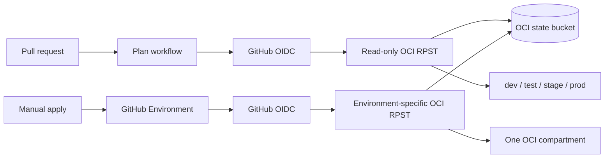

# Terraform on OCI with GitHub OIDC

This reference implements the GitHub-native golden path for Terraform on OCI across `dev`, `test`, `stage`, and `prod`.

- Non-secret environment configuration is versioned in [`workload/environments/`](workload/environments/).
- Pull request plans do not use GitHub Environments, so they do not create deployments or wait for deployment approval.
- Applies use the matching GitHub Environment and inherit its protection rules.
- GitHub OIDC tokens are exchanged for short-lived OCI Resource Principal Session Tokens (RPSTs).
- A read-only plan identity is separate from four environment-specific apply identities.
- Terraform state is isolated by environment in a versioned OCI Object Storage bucket.
- The sample creates only free VCN resources. It does not create compute, databases, gateways, or load balancers.

## Important OCI limitation

OCI workload identity federation removes OCI users and long-lived OCI API keys from the pipeline, but it is not completely secretless on a GitHub-hosted runner.

OCI's token exchange endpoint must authenticate the caller with one of:

1. An OCI Identity Domain OAuth confidential client.
2. An OCI service principal signed request.
3. An OCI instance principal signed request.

A GitHub-hosted runner is not an OCI service or instance principal, so this implementation stores one OAuth client credential. The credential can only invoke token exchange and is insufficient without a valid GitHub-signed JWT. The GitHub JWT, OCI RPST, and request-signing key are generated per job and expire automatically.

The plan job and four apply environments request distinct OIDC audiences. OCI maps the GitHub OIDC `sub` claim to `request.principal.name`, and IAM policies authorize the exact pull-request, default-branch, or GitHub Environment subject.

That is one bootstrap secret instead of duplicating dozens of application and infrastructure values across four GitHub Environments.

## Architecture



## Repository layout

| Path | Purpose |
| --- | --- |
| [`bootstrap/`](bootstrap/) | Creates the lab compartments, state bucket, OAuth client, issuer trust, and least-privilege policies. |
| [`workload/`](workload/) | Creates one disposable VCN using committed environment configuration. |
| [`scripts/bootstrap.sh`](scripts/bootstrap.sh) | Bootstraps OCI using a temporary local OCI CLI session. |
| [`scripts/configure-github.sh`](scripts/configure-github.sh) | Creates GitHub Environments and writes the generated client credentials and non-secret variables. |
| [`.github/workflows/oci-terraform-plan.yml`](.github/workflows/oci-terraform-plan.yml) | Plans all four environments on pull requests without a GitHub Environment. |
| [`.github/workflows/oci-terraform-apply.yml`](.github/workflows/oci-terraform-apply.yml) | Applies or destroys one selected environment behind its GitHub Environment. |

## Prerequisites

- Terraform 1.16 or newer.
- OCI CLI authenticated with a temporary session-token profile.
- GitHub CLI authenticated with repository administration access.
- An OCI identity domain and permission to manage compartments, policies, Object Storage, applications, and identity propagation trusts.

The bootstrap state contains generated OAuth client secrets. Keep it encrypted and access-controlled. It is ignored by Git and must never be uploaded as an artifact.

## Setup

From this directory:

```bash
./scripts/bootstrap.sh GITHUB_OCI_LAB
./scripts/configure-github.sh
```

The first command creates:

- A parent lab compartment.
- Four child compartments.
- One versioned state bucket.
- One OAuth token-exchange client and GitHub issuer trust.
- Policies restricted to this repository and the relevant GitHub OIDC claims.

The second command creates `dev`, `test`, `stage`, and `prod` GitHub Environments, restricts deployments to the default branch, sets repository variables, and writes the token-exchange credential.

Add required reviewers to the `stage` and `prod` Environments before treating this as a production deployment control.

## Workflows

The plan workflow runs for changes to this example. It has `id-token: write` but no GitHub Environment. The OCI trust only accepts the expected repository, and the OCI policy authorizes the exact pull-request or default-branch subject. Pull requests from forks are skipped because GitHub does not expose the token-exchange credential to fork workflows.

The apply workflow is manually dispatched from the default branch. Its job references the selected GitHub Environment, which:

- Makes the apply credential available only after environment protection passes.
- Adds the `environment` claim to the GitHub OIDC token.
- Selects an OCI policy condition limited to that GitHub Environment subject and OCI compartment.

## Configuration model

Each environment has a normal Terraform variable file:

```hcl
environment         = "prod"
vcn_cidr            = "10.40.0.0/16"
dns_label           = "prod"
service_tier        = "critical"
data_classification = "confidential"
```

Keep non-secret settings here, in shared module defaults, or in higher-level configuration code. Store actual application secrets in OCI Vault or another machine-secret manager and retrieve only the values required by the apply job. Do not turn GitHub secret names into a hand-built configuration database.

## Cleanup

Run the apply workflow with `operation=destroy` once for each environment. Then remove the GitHub repository settings and destroy the bootstrap:

```bash
terraform -chdir=bootstrap destroy
```

OCI will not delete a non-empty state bucket. Remove the state objects only after all four workload states have been destroyed and retained copies are no longer required.

## Sources

- [Oracle JWT-to-RPST workload identity federation](https://docs.oracle.com/en-us/iaas/Content/Identity/api-getstarted/token_exchange_grant_type_workload_id-federation.htm)
- [Oracle Terraform provider](https://github.com/oracle/terraform-provider-oci)
- [Oracle Crossplane provider non-OKE workload identity policies](https://github.com/oracle/crossplane-provider-oci/blob/main/docs/non-oke-workload-identity-auth.md)
- [OCI Terraform provider WorkloadIdentityFederation implementation](https://github.com/oracle/terraform-provider-oci/blob/v9.8.0/internal/provider/workload_identity_federation.go)
- [Terraform OCI backend](https://developer.hashicorp.com/terraform/language/backend/oci)
- [GitHub OIDC reference](https://docs.github.com/actions/reference/security/oidc)
